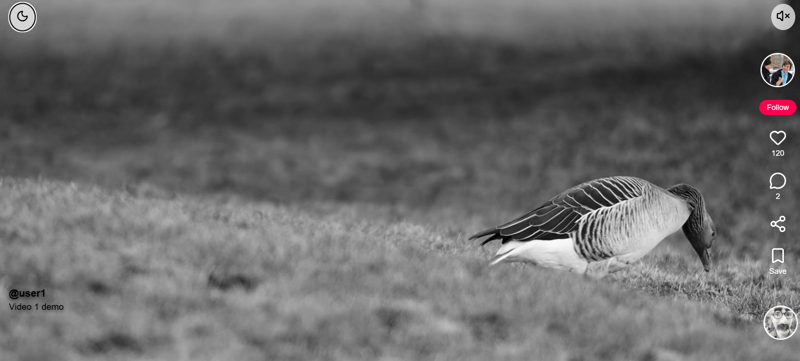
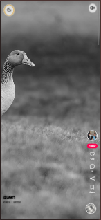
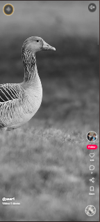

# 🎬 TikTok-Style Vertical Video Player

A modern **TikTok-style vertical video player** built using React.
This project replicates the core short-form video experience with smooth scrolling, auto-play, interactive overlays, and responsive UI.

---

## 🚀 Live Demo

👉 *(Add your deployed link here if available)*

## 🎥 Video Demo

👉 *(Paste your Loom / YouTube / Drive link here)*

---


## 📸 Preview






---

## ✨ Features

### 🎯 Core Features

* 📱 Full-screen vertical video feed (one video per viewport)
* 🔄 Infinite looping scroll (last → first seamlessly)
* ⬆️⬇️ Keyboard navigation (Arrow Up / Down)
* ▶️ Auto-play active video & auto-pause others
* ⏯ Tap to play/pause with overlay feedback
* 📊 Video progress bar

---

### ❤️ Interactive UI

* 👍 Like button (with animation + count)
* 💬 Comment system (bottom sheet modal + add comments)
* 🔗 Share (Web Share API + copy fallback)
* 🔖 Save/Bookmark (toggle + filled icon)
* 👤 Follow button (Follow / Following toggle)
* 🔊 Mute / Unmute toggle

---

### 🔥 Advanced Features

* ❤️ Double-tap to like (center heart animation)
* ⏸ Long-press to pause
* ⏳ Loading skeleton while video loads
* 🎵 Spinning music disc animation
* 🌙 Light / Dark mode (UI-only theme switch)
* 📱 Fully responsive (mobile + desktop)

---

## 🛠 Tech Stack

| Technology      | Usage                  |
| --------------- | ---------------------- |
| React (Hooks)   | UI & state management  |
| Vite            | Fast development setup |
| HTML5 `<video>` | Native video playback  |
| Lucide React    | Icons                  |
| CSS (custom)    | Styling & animations   |

---

## 🧠 Technical Decisions & Rationale

* ✅ **React Hooks** used for simplicity and modern patterns (no class components)
* ✅ **useRef** for direct video control (play/pause)
* ✅ **Intersection Observer** for detecting active video efficiently
* ✅ **No external video libraries** → better performance and control
* ✅ **Scroll snapping** ensures smooth TikTok-like experience
* ✅ **Component-based architecture** for scalability

---

## 📂 Folder Structure

```
frontend/
│
├── public/
│   └── videos/
│
├── src/
│   ├── assets/
│   │   └── Videos.js
│   │
│   ├── components/
│   │   ├── VideoFeed.jsx
│   │   ├── VideoCard.jsx
│   │   ├── ActionBar.jsx
│   │   ├── Overlay.jsx
│   │   └── ProgressBar.jsx
│   │
│   ├── App.jsx
│   ├── index.css
│   └── main.jsx
│
├── package.json
└── README.md
```

---

## ⚙️ Setup Instructions

### 1️⃣ Clone the repository

```bash
git clone https://github.com/prateekgb123/tiktok-player-prateekgballari.git
cd tiktok-player-prateekgballari
```

### 2️⃣ Install dependencies

```bash
npm install
```

### 3️⃣ Run the app

```bash
npm run dev
```

👉 Open: `http://localhost:5173`

---

## 🎮 Controls

| Action       | Behavior       |
| ------------ | -------------- |
| Click video  | Play / Pause   |
| Double click | Like ❤️        |
| Long press   | Pause          |
| Arrow Down   | Next video     |
| Arrow Up     | Previous video |
| Spacebar     | Play / Pause   |

---

## ⚡ Performance Optimizations

* Only **active video plays**
* Others are automatically paused
* Efficient re-renders using state isolation
* Smooth scroll via CSS snap + controlled navigation

---

## ⚠️ Limitations / Trade-offs

* No backend (likes/comments are local state only)
* No persistent storage (refresh resets data)
* Web Share API works best on mobile browsers
* Video assets are static (not dynamically fetched)

---

## 🔮 Future Improvements

* 🔐 User authentication
* ☁️ Backend integration (store likes/comments)
* 📊 Analytics (watch time tracking)
* 🎥 Upload feature
* 💾 Save videos to user profile
* 📡 Real-time comments

---

## 📌 Submission Checklist

* ✅ Public GitHub repository
* ✅ Clean commit history
* ✅ Working app (`npm install && npm run dev`)
* ✅ README with setup + features
* ✅ Video demo link included

---

## 👨‍💻 Author

**Your Name**
GitHub: https://github.com/prateekgb123

---

## ⭐ If you like this project

Give it a ⭐ on GitHub!
